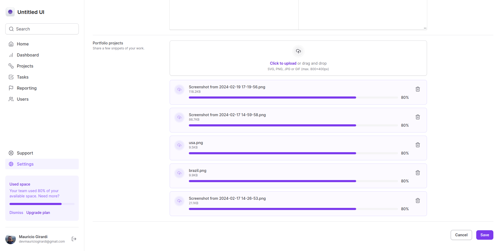

<h1 align="center">Untitled UI</h1>

Neste módulo, vimos sobre o Tailwind CSS, um framework de CSS focado em utilities. O Tailwind utiliza o conceito de interface declarativa, onde a estilização é feita próximo à estrutura do projeto. Isso evita a repetição de classes e facilita a estilização de elementos com variações. Apesar de deixar o HTML com muitas classes, isso não é um problema com as táticas e ferramentas que foram mostradas no curso.

### Layout

